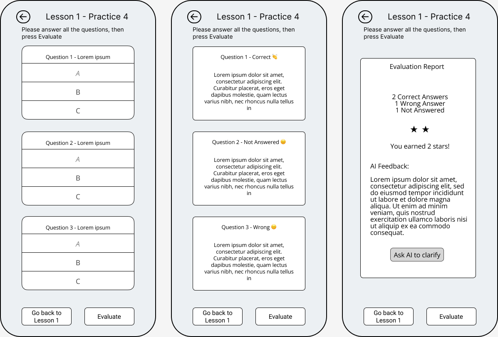

## Project Name: ***Italify***

 

## List of Violations for Both Prototypes:
### Web Prototype Violations:

1. Visibility of System Status
   - Location: After exercise scan pages
   - Issue: Confusion between levels of course, videos, and practices
   - Severity: 2

2. Consistency and Standards
   - Location: Main page
   - Issue: Profile button organization
   - Severity: 2

3. Flexibility and Efficiency of Use
   - Location: After watching the video
   - Issue: Points (Stars) not displayed on the main page
   - Severity: 3

4. Help Users Recognize, Diagnose, and Recover from Errors
   - Location: Before level page
   - Issue: Users are unable to recognize their level of determination
   - Severity: 3

### Mobile Prototype Violations:

1. Match Between System and the Real World - Severity 4
   - Location: Various pages
   - Issue: Need for a translate icon for language learning assistance.

2. User Control and Freedom - Severity 4
   - Location: All pages
   - Issue: Lack of menu accessibility for user navigation.

3. User Control and Freedom - Severity 2
   - Location: Home page
   - Issue: Need for a feedback icon for AI assistance outside of the evaluation page.

4. User Control and Freedom - Severity 2
   - Location: Practice page
   - Issue: Difficulty in identifying the correct answer.

5. Consistency and Standards - Severity 4 - <b> DUPLICATED violation </b>
   - Location: All pages
   - Issue: Need for a home icon for better navigation, rather than multiple back icons.

6. Consistency and Standards - Severity 2
   - Location: Final practices evaluation
   - Issue: Confusion regarding which icon leads to the final evaluation.

7. Consistency and Standards - Severity 1
   - Location: Final evaluation
   - Issue: The topic is still listed as 'practice,' causing confusion.

8. Consistency and Standards - Severity 3
   - Location: All pages
   - Issue: Need for a profile area for users to specify their name and mother tongue.

9. Error Prevention - Severity 3
   - Location: Practice page
   - Issue: Need for a keyboard to write answers.

10. Help and Documentation - Severity 4
    - Location: All pages
    - Issue: Absence of a Help Center for user assistance.

11. User control and freedom - Severity 3
    - Location: practice page
    - Issue: as a user, I need to save my progress in practice questions, so if my practice session is interrupted, I can resume from the state I was left. 

> We received 1 formal evaluation report for both prototypes and one informal suggestion from a classmate for the mobile prototype, so we merged it with other violations.

 

## Choosing between 2 prototypes
After a review and comparison of the violations and their severity levels for both the web and mobile prototypes, we have decided to move forward with the mobile prototype for Italify. This decision is based on several reasons:

1- Alignment with Project Goals: At Italify, one of our main objectives is to provide a fun and convenient platform for learning Italian in between work or while commuting. This goal is supported by the mobile app, which allows users to interact with the material whenever and wherever they have a brief window of free time, such as commutting time or during a coffee break.
 
 
2 -Fewer Severe Violations: When we looked at both versions, the mobile one had fewer valid critical issues than the web one. This means we don't need to make as many changes to the mobile app to make it work well, which saves us time and effort in developing it.

 
 

## Figma link to the Prototype
### Prototype: https://www.figma.com/proto/p5DRBozc1IQdVWSXpLfBPo/Untitled?type=design&node-id=1-17&t=8Lff3c6NJxYXlpXM-1&scaling=scale-down&page-id=0%3A1&starting-point-node-id=1%3A17&mode=design

### Screens: https://www.figma.com/community/file/1316453997450105217

 

## Plan for the hi-fi prototype
### The list of violations that we believe are not valid:
**#2 Menu shortcut:**    Since we have less than 3 direct functionalities, we decided to have no menu, and keep things aligned with best practices. 

**#3 Access AI ChatBot from the home page:** Originally we came up with the complex task of asking AI if you had any doubts about the practice the user has done, so it’s not much in favor of the complex task.

**#4 Showing correct answer:** We intentionally avoid doing so, to give the user the chance to take the test again. so he will be able to find his mistakes by himself and learn deeper.

**#6 Confusion with evaluation button:** Their comment is not very clear, but there is only one possible way to get the practice’s feedback, and that is with the specific button for that.

**#7 No change in the practice page title when the report is shown up:** When a user presses the Evaluate Now button, there is a pop-up box containing the report. And the background of this pop-up goes blurred, so the user probably will notice about changes, and doesn’t get confused.

**#8 Missing profile icon:** Since we didn’t intend to incorporate having an account and stuff, we didn’t consider such a thing at first. But again after consulting among team members, we concluded that we don’t need any task tied with having an account or there is no usage of it

**#9 No keyboard presented:** When a user enters the ChatBot page, a keyboard appears on the screen. If he/she dismisses the keyboard, he can retrieve it again by tapping inside the textbox, like other applications we use daily. So we hadn’t shown the keyboard in the low-level prototype just for simplicity.  

 

### Violations with severity 4:
**#1 Missing translate icon:** We decided to provide the English translation of each Italian sentence when the user taps on that Italian sentence. We show the user the translation in a small pop-up for a limited time, then it disappears automatically.

**#5 Missing home button:** We thought maybe the best position to put it, is the top right corner.

**#10 Missing help center:** We believe the application is self-informative enough, so the users won’t probably get confused. But we will wait until the usability test, and if then it becomes clear that we need such a thing, we can add a button to the top right corner of the home page, when pressed, shows some general info about how the application is structured.

 

### Violations with severity 3:
**#11 Save functionality:** We will ask the user to save before leaving in the middle of answering practices. And if he wishes, we will store his partial answers. Just need to add another button to the UI.

 

### Violations with severity 2:
Nothing here

### Violations with severity 1:
Nothing here

